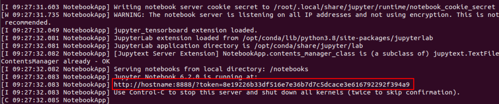
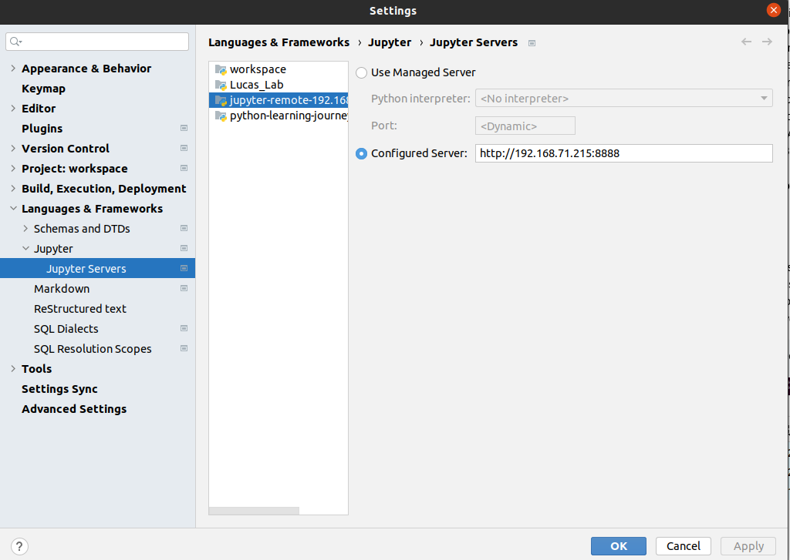
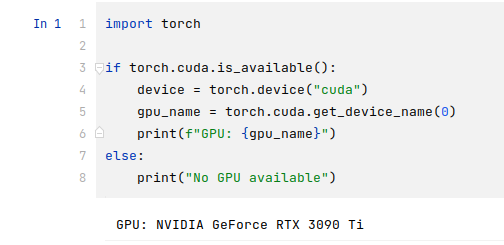

## Docker CMD
 ```
docker run --gpus all \
-p 8888:8888 \
-v ~/lucaslab:/notebooks \
-e NVIDIA_VISIBLE_DEVICES=all \
nvcr.io/nvidia/pytorch:21.03-py3 \
jupyter-notebook \
--allow-root \
--notebook-dir=/notebooks \
--ip='*' \
--port=8888 \
--no-browser
 ```

Here are the detailed descriptions of each parameter used in the docker run command:

* --gpus all: Instructs Docker to use all available GPU resources. This option requires the use of NVIDIA Docker in order to access the GPU resources within the container.

* -p 8888:8888: Maps port 8888 of the container to port 8888 of the host. This allows you to access the Jupyter Notebook running inside the container through the host's browser.

* -v ~/lucaslab:/notebooks: Maps the local folder ~/lucaslab to the /notebooks folder inside the container. This allows you to save and access files inside the container.

* -e NVIDIA_VISIBLE_DEVICES=all: Specifies which NVIDIA GPU devices can be used inside the container. Here, all means that all available GPU devices can be used.

* nvcr.io/nvidia/pytorch:21.03-py3: Specifies the name and tag of the Docker image to be run. Here, the image is NVIDIA's PyTorch image, based on PyTorch 1.8 and Python 3.9.

* jupyter-notebook: Specifies the command to be run inside the container. Here, it is Jupyter Notebook.

* --allow-root: Allows Jupyter Notebook to run as the root user.

* --notebook-dir=/notebooks: Specifies the working directory for Jupyter Notebook as the /notebooks folder.

* --ip='*': Allows Jupyter Notebook to be accessed from any IP address.

* --port=8888: Specifies the port number for Jupyter Notebook to use as 8888.

* --no-browser: Prevents the automatic opening of a browser. This is to prevent the opening of a browser outside the container while running Jupyter Notebook inside the container.

Overall, this command runs NVIDIA's PyTorch image to run Jupyter Notebook inside the container using all available GPU resources. The command also maps the /notebooks folder of the container to the local ~/lucaslab folder, maps port 8888 of the container to port 8888 of the host, and allows you to access the Jupyter Notebook through the local browser.

> keep a record of the token
> 
> 
> 
> Copy and paste the URL and PORT to the Jupyter Server settings under 'Jupyter Servers
> 
> 
> After adding the URL and PORT to the Jupyter Server settings and clicking 'Connect', you will be prompted to enter the token.
> 
> You can use the following code to check if the GPU device is available and device name:

> 